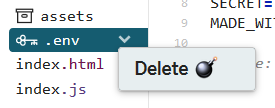

# FS API Sample App

A sample app for getting started with the [FamilySearch API](https://familysearch.org/developers/).
The app uses the [fs-js-lite SDK](https://github.com/FamilySearch/fs-js-lite)
to show how to perform basic API operations such as authentication, 
loading the user's profile, and loading the user's pedigree.

_This app is not intended to be an example of best practices for the web._

## Try It Out

We will use [Glitch](https://glitch.com/) to copy the sample app into an online
development environment so that you can run and modify the sample app without
installing anything.

1. Follow the [Getting Started Guide](https://familysearch.org/developers/docs/guides/getting-started) to 
create a developer account and register an app. You can name the app anything you
want. We recommend it be descriptive, such as "FS Sample App." For the redirect URI,
just put "http://localhost". We will change that later.

1. Click the "Remix on Glitch" button above to have the sample app automatically
imported into Glitch with an editor and environment ready to go.

    > If a `.env` file is automatically added then you'll need to delete it.
    
    

1. Click the "Show" button at the top to preview the app. Your app will be available 
at URL of the form `https://[RANDOM_APP_NAME].glitch.me/`. For example, 
`https://telling-pine.glitch.me/`.

1. Update the registered redirect URI of your app, from step 1 above, to match
the `glitch.me` URL of your app.

1. Open `index.js` in the Glitch editor. 

1. Modify the value of `APP_KEY` to match the app key generated in step 1 above.

1. Modify the value of `REDIRECT_URI` to match the `glitch.me` URL of your app.

1. Click the "Show" button at the top again. You should be able to run the app,
login with FamilySearch, and see your integration user's pedigree automatically loaded.